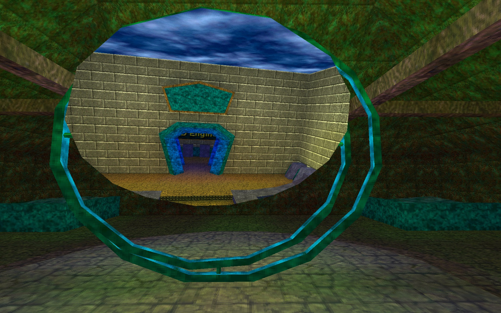
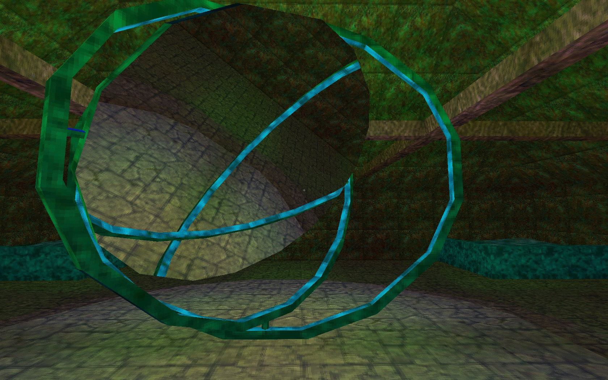
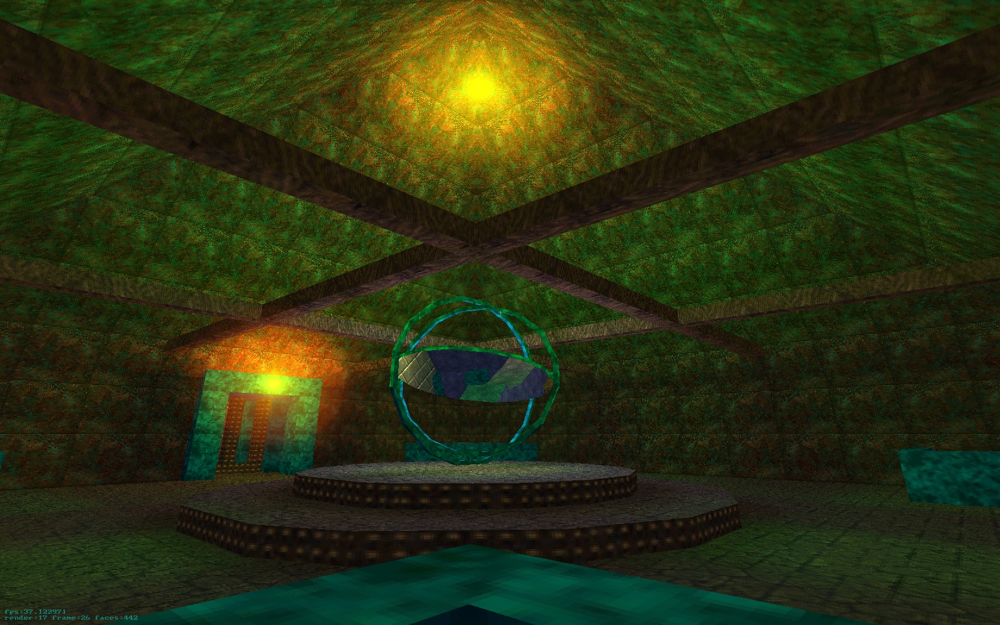
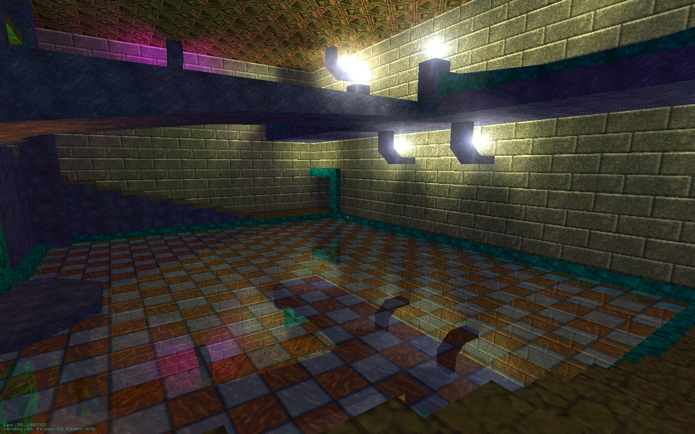
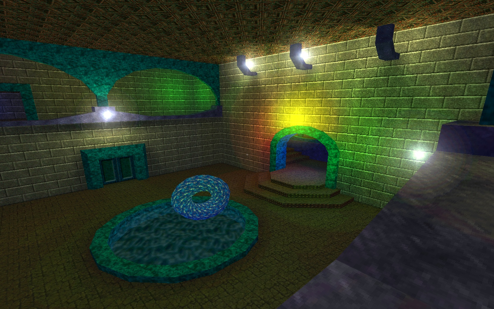
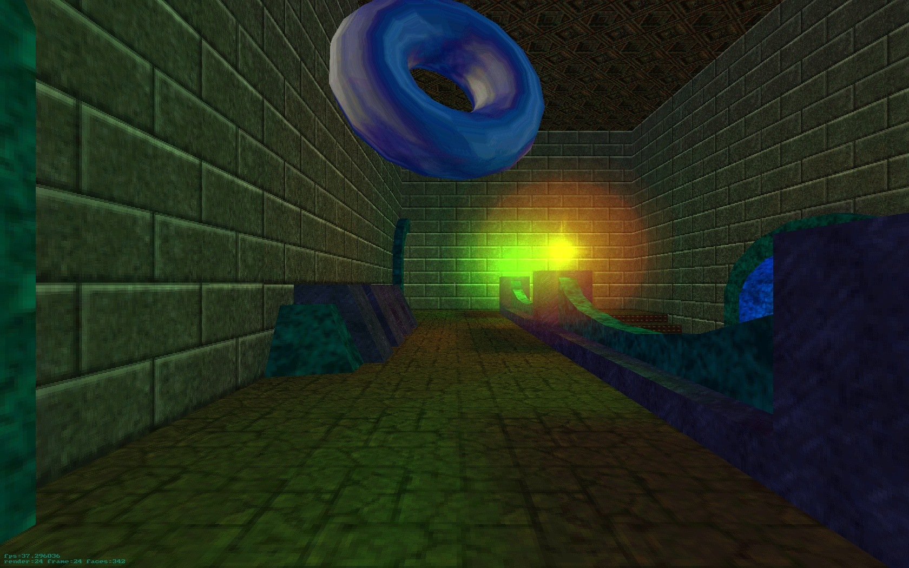
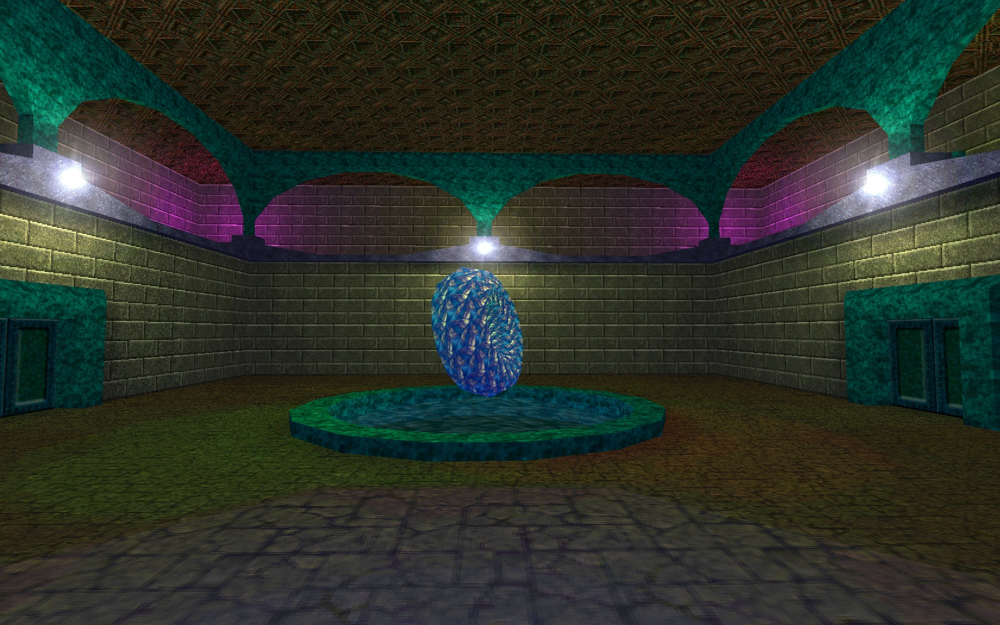
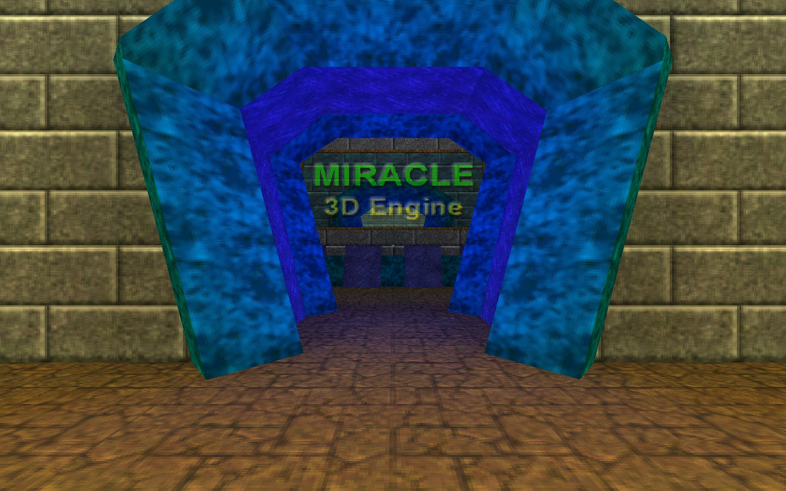
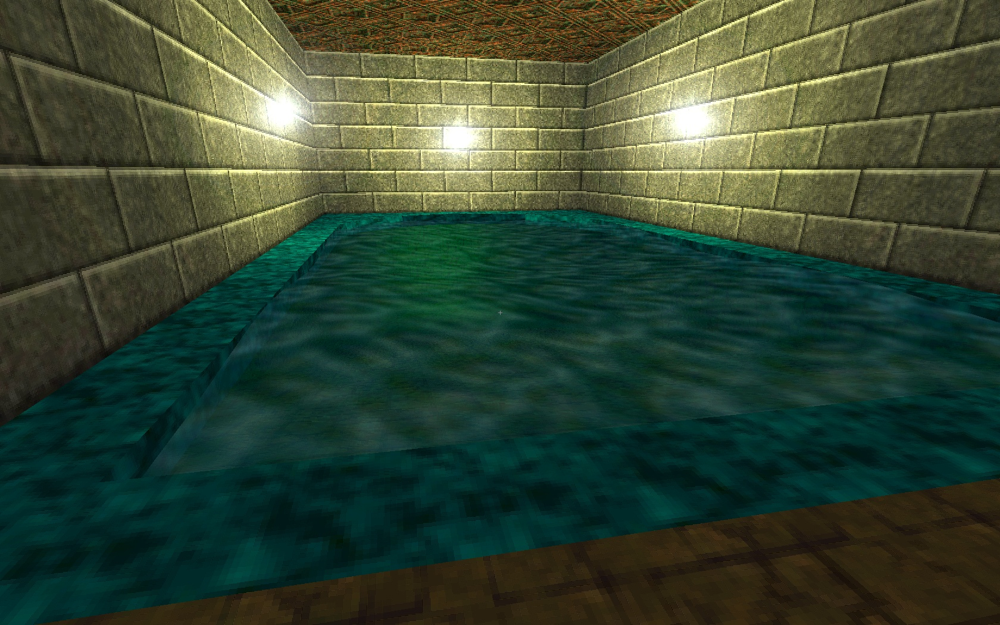
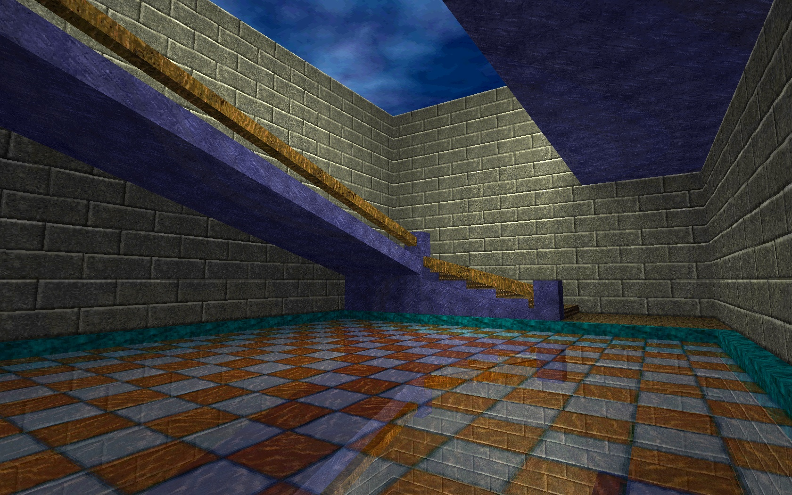

# Miracle
A software rendering 3D Engine developed in the late 90s.

## Features

- BSP + portals scene rendering mechanism
- High color graphics (15/16 bit)
- Colored static and dynamic lighting
- Static and dynamic mirrors
- Static and dynamic portals
- Animated water
- Mipmapping (4 levels)
- Light source glares
- Basic movement physics
- Console support

## Screenshots

## Control Keys:

| Key            | Action                     |
|----------------|----------------------------|
| W or &uarr;    | Move forward               |
| S or &darr;    | Move backward              |
| D              | Move right                 |
| A              | Move left                  |
| Home           | Move up                    |
| End            | Move down                  |
| Space          | Jump                       |
| &larr;         | Turn left                  |
| &rarr;         | Turn right                 |
| Page Up        | Look up                    |
| Page Down      | Look down                  |
| E              | Roll clockwise             |
| Q              | Roll counterclockwise      |
| Enter          | Stop and center view       |
| ~              | Toggle console             |
| Pause          | Pause / unpause            |
| F12            | Quit                       |

## Console commands:

The console can be opened or closed using the ~ (tilde) key.

| Command                          | Description                                                                                   |
|----------------------------------|-----------------------------------------------------------------------------------------------|
| `map <map name>`                 | Load a map                                                                                    |
| `exec <file name>`               | Execute a configuration file                                                                  |
| `videomode <xsize> <ysize>`      | Change video mode (x, y)                                                                      |
| `videomodelist`                  | Display all available video modes                                                             |
| `gamma <gamma>`                  | Gamma (-320..320)                                                                             |
| `viewsize <size>`                | Screen size (in % of maximum)                                                                 |
| `fov <angle>`                    | Camera field of view                                                                          |
| `zoom`                           | Change camera field of view to `zoomfov` angle                                                |
| `autozoom`                       | Automatic zoom (`zoomfov` is determined based on `zoomdist`)                                  |
| `zoomfov <angle>`                | Camera field of view during zoom                                                              |
| `zoomdist <distance>`            | Distance for determining `zoomfov`                                                            |
| `drawfps`                        | Display rendering statistics                                                                  |
| `drawmode [<drawmode>]`          | Rendering mode [0..3]                                                                         |
| `bind <key> <command>`           | Bind command to a key (works with only one command without parameters)                        |
| `credits`                        | Display engine version                                                                        |
| `pause`                          | Pause                                                                                         |
| `openconsole`                    | Open the console                                                                              |
| `closeconsole`                   | Close the console                                                                             |
| `pushconsole`                    | Toggle the console                                                                            |
| `invertmouse`                    | Invert mouse                                                                                  |
| `mousespeed <speed>`             | Mouse turn speed                                                                              |
| `position <x> <y> <z>`           | Set camera position                                                                           |
| `tangles <x> <y> <z>`            | Set camera rotation angles (in °)                                                             |
| `forwardspeed <speed>`           | Set camera forward movement speed                                                             |
| `backspeed <speed>`              | Set camera backward movement speed                                                            |
| `sidespeed <speed>`              | Set camera side movement speed                                                                |
| `turnspeed <speed>`              | Set camera turn speed                                                                         |
| `forward`                        | Move forward                                                                                  |
| `back`                           | Move backward                                                                                 |
| `moveright`                      | Move right                                                                                    |
| `moveleft`                       | Move left                                                                                     |
| `moveup`                         | Move up                                                                                       |
| `movedown`                       | Move down                                                                                     |
| `lookup`                         | Look up (pitch angle)                                                                         |
| `lookdown`                       | Look down (pitch angle)                                                                       |
| `turny0`                         | Roll counterclockwise                                                                         |
| `turny1`                         | Roll clockwise                                                                                |
| `right`                          | Turn right (yaw angle)                                                                        |
| `left`                           | Turn left (yaw angle)                                                                         |
| `stop`                           | Stop and level the camera horizontally                                                        |
| `walk`                           | Enable real movement                                                                          |
| `fly`                            | Enable ability to fly                                                                         |
| `noclip`                         | Enable ability to fly and pass through walls                                                  |
| `quit`                           | Quit
